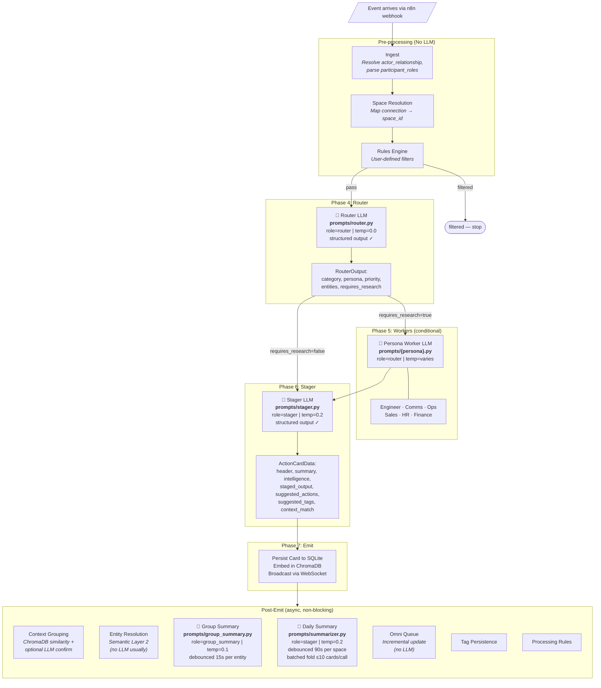
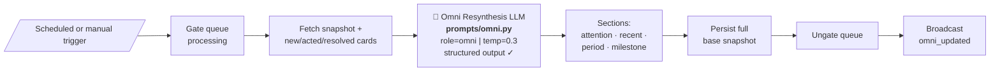
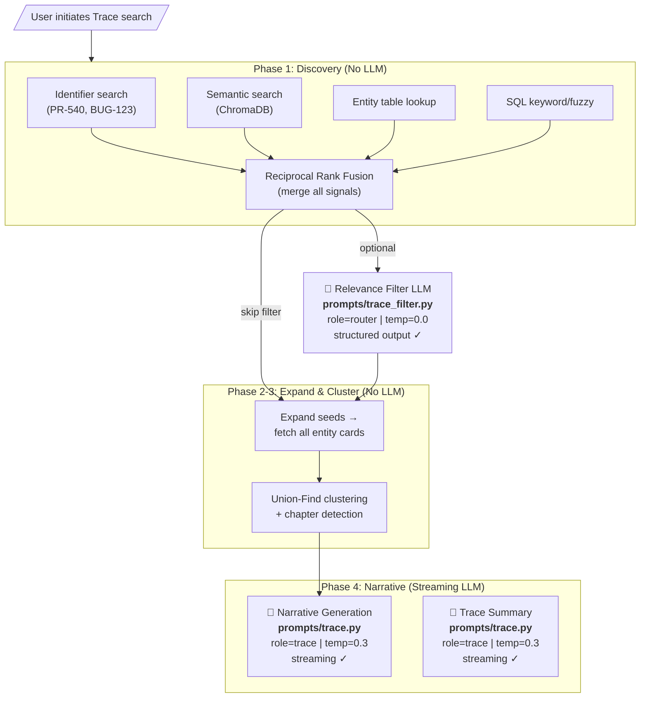
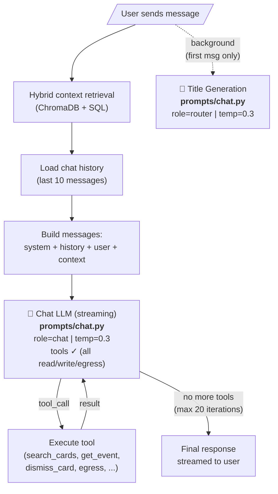
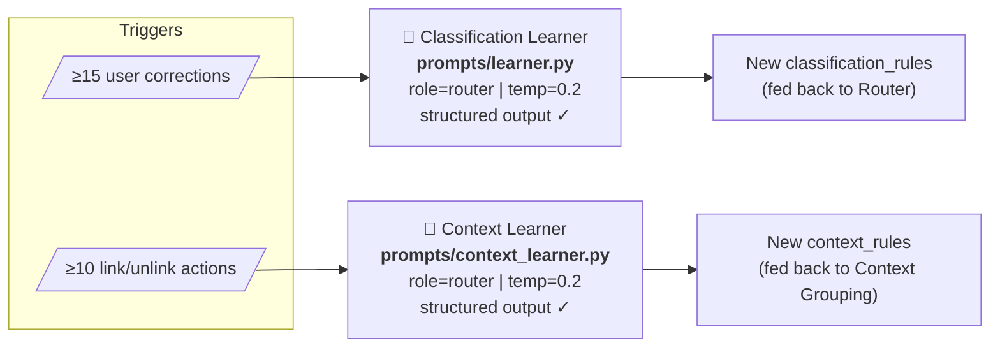
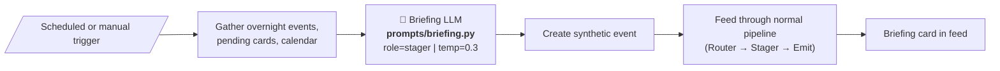
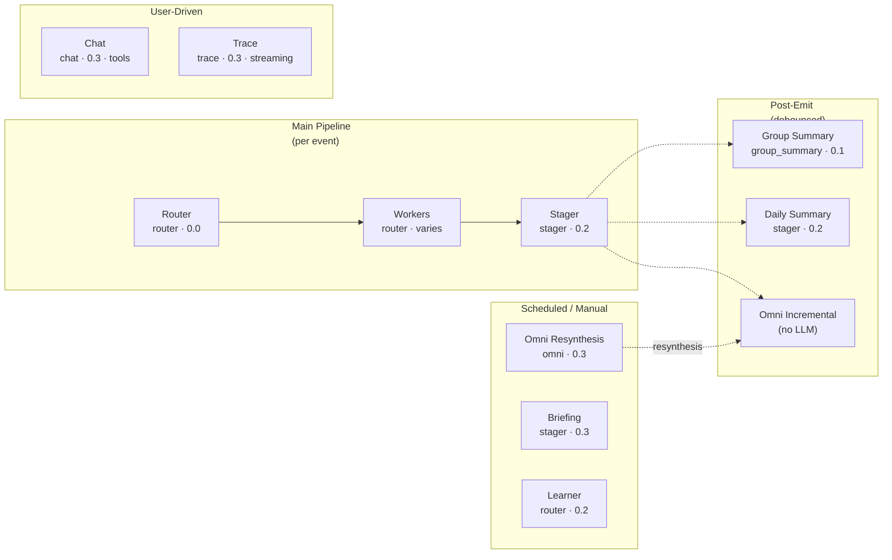

# Laya Pipeline Lifecycle — Prompt Stages

## Event Processing Pipeline (Main Flow)



## Omni Resynthesis (Scheduled)



## Trace (User-Initiated Search)



## Chat (Multi-Turn with Tools)



## Learning Pipelines (Feedback-Driven)



## Briefing (Scheduled/Manual)



## Complete LLM Touchpoint Summary



## Date/Time Injection

All LLM calls receive temporal awareness via centralized injection in `llm_call()`:

```
[Current date/time: 2026-06-07 14:30:00 UTC (Saturday)]

{actual user message content}
```

This is injected into the **last user message** (not the system prompt) to preserve prompt caching.
